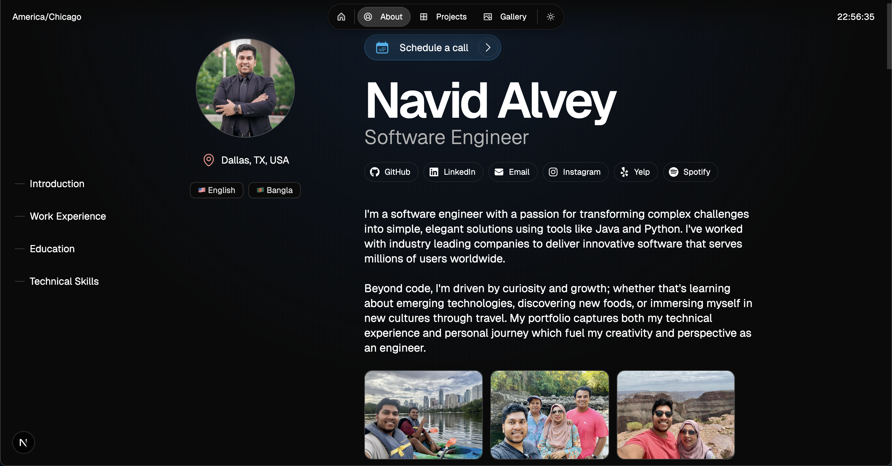

# Navid Alvey's Personal Portfolio

If you're seeing this, welcome to my portfolio's code base. To start off, the READMe file is just a general overview of the actual project itself. Theres some photos (and probably video demos if I get to it tbh) that will show you the general layout of the website itself. If for whatever reason you've come to the GitHub first, go to the actual website and check it out (I didn't put all my time and effort into building it for nothing!). 

I'll be adding more content to it like personal highlights from Yelp & Spotify but also RANKED LISTS of various topics like foods, restaurants, books, movies, games, etc. Just some more personal details & hobbies that could show more character outside of work, work, & work.

## Portfolio Overview

## Portfolio Layout

**1. Home Page**
- Welcome message
- Featured projects
- Latest updates

**2. About Page**
- Introduction
- Work Experience
- Education
- Technical Skills

**3. Projects Page**
- Spring Boot Fintech Banking w/ Feature Services
- Bookmark Manager w/ MCP Agent & Clerk Authentication Integration
- UTDesign & XONA Partners: Senior Capstone 5G Data Analytics Pipelining
- Personal Portfolio Project

**4. Gallery Page**
- A whole gallery of personal photos

## Technologies Used
**Core Framework**
- Next.js
- React
- TypeScript
- Node.js

**Development Tools**
- Biome
- ESLint
- Lint Staged